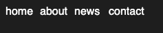

# Воркшоп по анимации

Требования:

+ Сделать кастомизируемое подчёркивание у ссылки (тэг `<a>`);
    + Касмтоимизироваться должно расположение
    + Цвет
    + Размер
    + При изменении размера шрифта, длина подчёркивания должна адаптироваться
+ Появление и исчезновение подчёркивания у ссылки должно быть плавно анимировано при наведении на неё:
    + При появлении анимировать слева направо;
    + При исчезновении анимировать справа налево.

Подход выбирать самостоятельно, главное достичь цели.

### Пример

